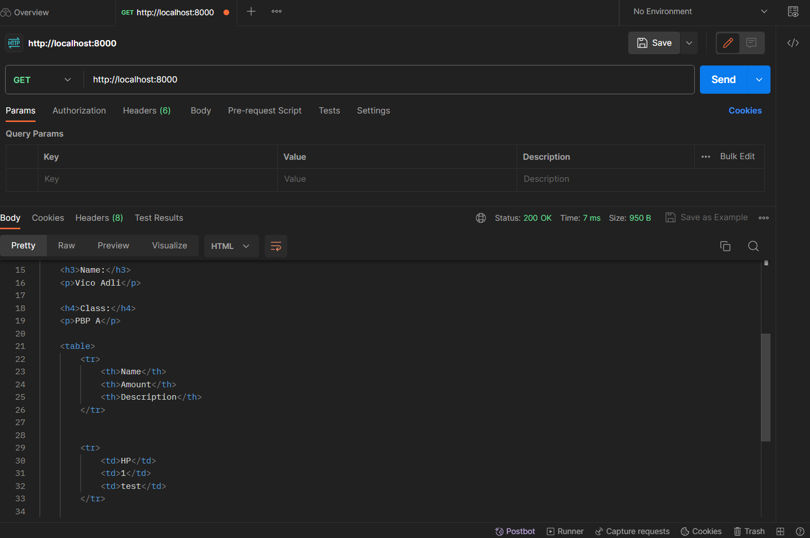
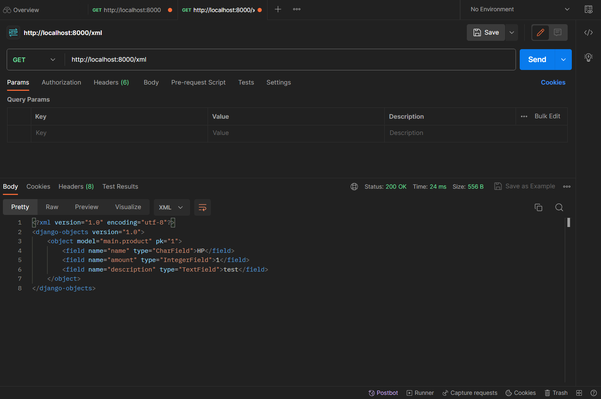
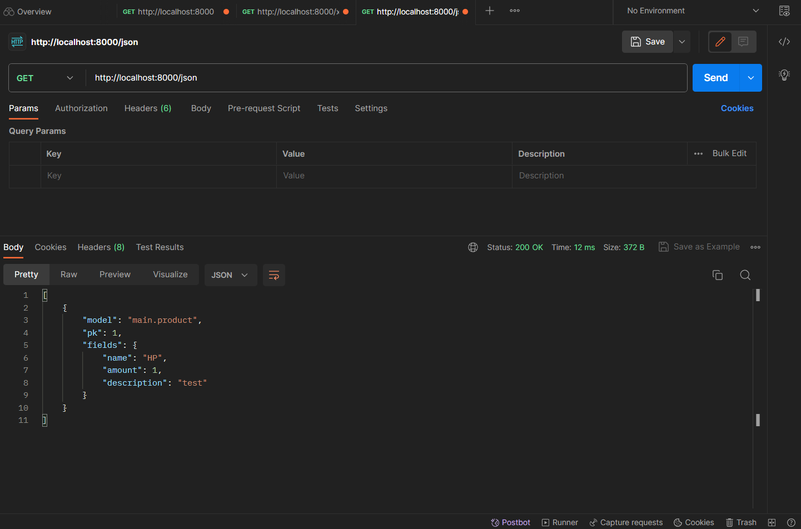
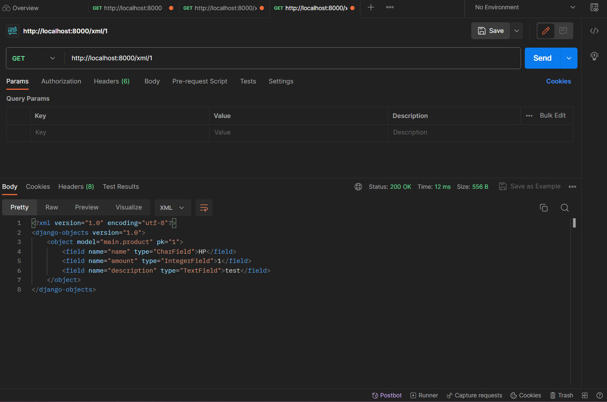
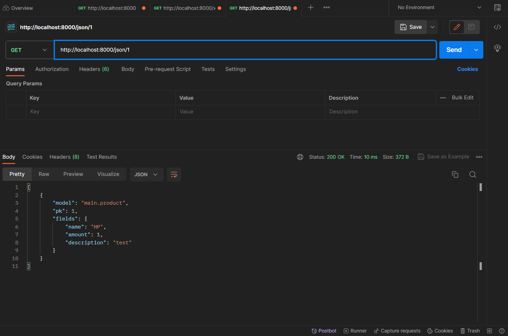

Penjelasan Tugas 2

1
Buat virtual environment dengan python -m venv env setelah berhasil cd pada command prompt ke direktori tujuan
Lalu aktifkan venv dengan env\Scripts\activate.bat
Buat requirements.txt untuk menambahkan dependencies seperti django, gunicorn, whitenoise, psycopg2-binary, requests, urllib3 lalu pasang dengan pip install -r requirements.txt
Saya buat proyek Django baru dengan perintah django-admin startproject pbp_project .
Menambahkan "*" pada variabel ALLOWED_HOSTS di settings.py untuk keperluan deployment
Membuat aplikasi baru dengan python manage.py startapp main
Menambahkan "main" pada variabel INSTALLED_APPS di settings.py untuk keperluan pendaftaran aplikasi main
Membuat folder bernama templates di dalam direktori main dan membuat file main.html di dalam direktori templates. Isi file dengan nilai yang sesuai
Buka berkas models.py pada direktori aplikasi main dan isi dengan kode yang diperlukan
Membuat migrasi model dengan python manage.py makemigrations
Terapkan migrasi dengan python manage.py migrate
Buka berkas views.py yang terletak di dalam berkas aplikasi main dan isi dengan kode yang diperlukan
Buat berkas urls.py di dalam direktori main dan isi dengan kode yang diperlukan
Buka berkas urls.py di dalam direktori pbp_project dan isi dengan kode yang diperlukan
Jalankan server django dengan python manage.py runserver

2
Bagan request client ke web aplikasi berbasis Django beserta responnya akan bergantung pada interaksi antara client, URL routing (urls.py), views (views.py), models (models.py), dan berkas HTML.

[Client] --> [URLs.py] --> [Views.py] --> [Models.py] --> [HTML Template]
           <--           <--           <--             <--
           HTTP Request           Data Query          Data Rendering

Client: Membuat HTTP request untuk mengakses aplikasi.
URLs.py: Mengarahkan request ke view yang sesuai berdasarkan URL yang diterima.
Views.py: Memproses request, mengakses data dari model jika diperlukan, dan mengirim data ke template HTML.
Models.py: Menyimpan definisi data model (dalam hal ini, model 'Item').
HTML Template: Mengambil data yang dikirim oleh views dan merendernya ke dalam tampilan HTML yang dapat dilihat oleh client.

3
1. Virtual environment memungkinkan kita untuk mengisolasi dependensi proyek kita dari lingkungan Python sistem yang lebih besar.
2. Virtual environment memungkinkan kita untuk mengelola dependensi proyek kita dengan lebih baik.
3. Virtual environment membantu menjaga lingkungan Python sistem kita tetap bersih dan tidak tercampur dengan dependensi proyek.
4. Dengan menggunakan virtual environment, kita dapat mencatat dependensi proyek kita dalam sebuah berkas (seperti requirements.txt) sehingga kita atau orang lain dapat dengan mudah menginstal semua dependensi yang diperlukan pada lingkungan yang sama dan memastikan bahwa proyek berjalan dengan konsisten.

Secara teori, kita masih dapat membuat aplikasi web Django tanpa menggunakan virtual environment, tetapi ini akan menjadi praktik yang sangat tidak disarankan karena dapat menghasilkan berbagai masalah dan konflik dalam pengembangan proyek

4
MVC (Model-View-Controller) adalah paradigma yang memisahkan aplikasi menjadi tiga komponen utama: Model (data dan bisnis logic), View (tampilan pengguna), dan Controller (mengatur interaksi antara Model dan View). MVC umumnya digunakan dalam kerangka kerja seperti Ruby on Rails.

MVT (Model-View-Template) adalah varian Django dari MVC. Dalam MVT, Model masih mengacu pada data dan bisnis logic, View adalah logika yang mengatur tampilan, dan Template adalah bagian yang menangani tampilan HTML. Django memanfaatkan konsep Template yang kuat.

MVVM (Model-View-ViewModel) adalah paradigma yang digunakan dalam pengembangan aplikasi berbasis antarmuka pengguna (UI). Ini memisahkan Model (data), View (tampilan UI), dan ViewModel (logika untuk mengatur tampilan dan data). MVVM lebih sering digunakan dalam pengembangan aplikasi seluler atau berbasis desktop.

Perbedaan utama adalah dalam cara mereka mengatur komponen-komponen utama aplikasi dan peran masing-masing komponen. Django mengikuti paradigma MVT yang merupakan variasi dari MVC.

Penjelasan Tugas 3

Apa perbedaan antara form POST dan form GET dalam Django?
Form POST:

1. Mengirimkan data dalam badan permintaan HTTP.
2. Data tidak terlihat dalam URL.
3. Dapat digunakan untuk mengirim data yang lebih besar, seperti data formulir yang kompleks.
4. Lebih aman untuk mengirim data sensitif, karena tidak terlihat dalam URL.
5. Digunakan untuk mengirim data yang akan diproses oleh server, seperti saat mengirim formulir untuk disimpan di database.

Form GET:

1. Mengirimkan data sebagai parameter dalam URL.
2. Data terlihat dalam URL.
3. Digunakan untuk mengirim data yang relatif kecil dan tidak sensitif, seperti permintaan pencarian atau filter.
4. Mudah di-bookmark atau di-share karena data terdapat dalam URL.
5. Data dikirim sebagai permintaan HTTP, tetapi terlihat dalam URL.

Apa perbedaan utama antara XML, JSON, dan HTML dalam konteks pengiriman data?
XML (eXtensible Markup Language):

1. Berbasis teks dan memiliki sintaks yang kaku.
2. Digunakan untuk pertukaran data dan struktur dokumen.
3. Memiliki dukungan yang luas untuk validasi dan pemrosesan data.
4. Tidak cocok untuk pertukaran data antar aplikasi web modern karena overheadnya.

JSON (JavaScript Object Notation):

1. Berbasis teks dan memiliki sintaks yang ringan.
2. Digunakan untuk pertukaran data terstruktur antara aplikasi web.
3. Mudah dibaca oleh manusia dan diproses oleh mesin.
4. Format data yang populer dalam pengembangan aplikasi web dan API RESTful.

HTML (HyperText Markup Language):

1. Digunakan untuk menggambarkan struktur dan tampilan halaman web.
2. Tidak digunakan untuk pertukaran data antar aplikasi, tetapi untuk menampilkan konten web.
3. Berisi elemen-elemen markup yang digunakan untuk memformat dan menyajikan konten di browser.

Mengapa JSON sering digunakan dalam pertukaran data antara aplikasi web modern?
1. JSON memiliki format yang ringan, sehingga mengurangi overhead dalam pengiriman data melalui jaringan.
2. JSON mudah dibaca oleh manusia dan mudah diproses oleh mesin.
3. JSON didukung oleh berbagai bahasa pemrograman, sehingga data dapat dengan mudah diuraikan dan dibangun kembali oleh berbagai aplikasi.
4. JSON cocok dengan pendekatan arsitektur RESTful dalam pengembangan layanan web, yang populer dalam pembuatan API web modern.
5. JSON dapat mewakili struktur data yang kompleks, termasuk objek dan larik bersarang, sehingga cocok untuk pertukaran data yang kompleks antar aplikasi.
6. JSON adalah bagian integral dari JavaScript, sehingga sangat mudah digunakan dalam pengembangan web berbasis JavaScript.
7. Banyak layanan web publik dan API pihak ketiga menyediakan data dalam format JSON, sehingga memudahkan integrasi aplikasi dengan sumber daya eksternal.

Langkah-langkah membuat input form untuk menambahkan objek model pada app sebelumnya, menambahkan 5 fungsi views untuk melihat objek yang sudah ditambahkan dalam format HTML, XML, JSON, XML by ID, dan JSON by ID, dan mmembuat routing URL untuk masing-masing views yang telah ditambahkan:
1. Membuka urls.py yang ada pada folder pbp_project dan mengubah path main/ menjadi '' pada urlpatterns
2. Membuat folder templates pada root folder dan membuat sebuah berkas HTML baru bernama base.html, isi dengan kode yang diperlukan
3. Membuka settings.py yang ada pada subdirektori pbp_project dan mencari baris yang mengandung TEMPLATES. Isi dengan kode yang diperlukan
4. Pada subdirektori templates yang ada pada direktori main, mengubah kode berkas main.html yang telah dibuat di tutorial sebelumnya dengan kode yang diperlukan
5. Membuat berkas baru pada direktori main dengan nama forms.py untuk membuat struktur form yang dapat menerima data produk baru. Isi dengan kode yang diperlukan
6. Membuka berkas views.py yang ada pada folder main dan menambahkan beberapa import. Dalam hal ini : from django.http import HttpResponseRedirect, from main.forms import ProductForm, from django.urls import reverse . Panggil juga from main.models import Product
7. Membuat fungsi baru dengan nama create_product pada views.py yang menerima parameter request dan menambahkan potongan kode yang diperlukan untuk menghasilkan formulir yang dapat menambahkan data produk secara otomatis ketika data di-submit dari form.
8. Menambah fungsi show_main yang sudah ada pada berkas views.py dengan 'products': products di dalam context
9. Membuka urls.py yang ada pada folder main dan mengimport fungsi create_product (from main.views import show_main, create_product)
10. Menambahkan path url ke dalam urlpatterns pada urls.py di main untuk mengakses fungsi yang sudah di-import
11. Membuat berkas HTML baru dengan nama create_product.html pada direktori main/templates. Isi dengan kode yang diperlukan
12. Buka main.html dan menambahkan kode yang diperlukan di dalam  untuk menampilkan data produk dalam bentuk table serta tombol "Add New Product" yang akan redirect ke halaman form.

13. Membuka views.py yang ada pada folder main dan menambahkan import HttpResponse dan Serializer pada bagian paling atas (from django.http import HttpResponse, from django.core import serializers)
14. Membuat sebuah fungsi yang menerima parameter request dengan nama show_xml dan membuat sebuah variabel di dalam fungsi tersebut yang menyimpan hasil query dari seluruh data yang ada pada Product. Tambahkan return function berupa HttpResponse yang berisi parameter data hasil query yang sudah diserialisasi menjadi XML dan parameter content_type="application/xml".
15. Membuka urls.py yang ada pada folder main dan import fungsi show_xml 
16. Tambahkan path url ke dalam urlpatterns untuk mengakses fungsi show_xml 

17. Membuka views.py yang ada pada folder main dan membuat sebuah fungsi baru yang menerima parameter request dengan nama show_json dengan sebuah variabel di dalamnya yang menyimpan hasil query dari seluruh data yang ada pada Product.Tambahkan return function berupa HttpResponse yang berisi parameter data hasil query yang sudah diserialisasi menjadi JSON dan parameter content_type="application/json".
18. Membuka urls.py yang ada pada folder main dan import fungsi show_json
19. Tambahkan path url ke dalam urlpatterns untuk mengakses fungsi show_json

20. Membuka views.py yang ada pada folder main dan membuat sebuah fungsi baru yang menerima parameter request dan id dengan nama show_xml_by_id dan show_json_by_id. Buatlah sebuah variabel di dalam fungsi tersebut yang menyimpan hasil query dari data dengan id tertentu yang ada pada Product. Tambahkan return function berupa HttpResponse yang berisi parameter data hasil query yang sudah diserialisasi menjadi JSON atau XML dan parameter content_type dengan value "application/xml" (untuk format XML) atau "application/json" (untuk format JSON).
21. Membuka urls.py yang ada pada folder main dan impor fungsi show_xml_by_id dan show_json_by_id 
22. Tambahkan path url ke dalam urlpatterns untuk mengakses fungsi show_xml_by_id dan show_json_by_id 

Penjelasan Tugas 4

Apa itu Django UserCreationForm, dan jelaskan apa kelebihan dan kekurangannya?
Django UserCreationForm adalah salah satu bentuk form yang disediakan oleh Django, sebuah framework pengembangan web Python yang populer. Formulir ini digunakan untuk membuat formulir pendaftaran pengguna (user registration form) dalam aplikasi web Django. Dengan menggunakan UserCreationForm, kita sebagai pengembang dapat dengan mudah membuat halaman pendaftaran user yang memungkinkan user baru untuk mendaftar dengan username, password, dan informasi lain yang diperlukan.
Kelebihan:
- Memudahkan dalam membuat formulir pendaftaran user.
- Terintegrasi dengan sistem otentikasi Django, sehingga user yang terdaftar akan disimpan dalam basis data secara otomatis.
- Mengatur validasi data input, termasuk validasi password yang kuat.
Kekurangan:
- Tampilan (UI/UX) dari UserCreationForm mungkin perlu disesuaikan agar sesuai dengan kebutuhan desain aplikasi web.
- Penggunaan default mungkin tidak cukup jika memiliki persyaratan pendaftaran yang kompleks, seperti validasi email atau persetujuan admin.

Apa perbedaan antara autentikasi dan otorisasi dalam konteks Django, dan mengapa keduanya penting?
Autentikasi adalah proses memverifikasi identitas pengguna, yaitu memastikan bahwa pengguna yang mencoba mengakses sistem atau aplikasi adalah orang yang dia klaim. Django menyediakan sistem autentikasi yang terintegrasi yang mencakup otentikasi berbasis session, otentikasi berbasis token, serta kemampuan untuk menghubungkan sistem otentikasi eksternal.
Otorisasi adalah proses mengendalikan hak akses pengguna terverifikasi ke berbagai bagian sistem atau aplikasi. Ini menentukan apa yang diizinkan atau tidak diizinkan pengguna lakukan setelah mereka terautentikasi. Django memiliki sistem otorisasi berbasis perizinan yang memungkinkan pengembang untuk mendefinisikan perizinan (permissions) yang mengatur hak akses pengguna terhadap objek-objek dalam aplikasi.
Keduanya penting karena autentikasi mengidentifikasi user, sedangkan otorisasi mengatur apa yang dapat dilakukan user setelah diidentifikasi. Tanpa autentikasi, tidak ada cara untuk memverifikasi identitas user, dan tanpa otorisasi, tidak ada cara untuk mengontrol hak akses pengguna ke data atau fungsi tertentu dalam aplikasi.

Apa itu cookies dalam konteks aplikasi web, dan bagaimana Django menggunakan cookies untuk mengelola data sesi pengguna?
Cookies adalah data kecil yang disimpan di sisi client (pada perangkat pengguna) oleh server web. Cookies digunakan untuk menyimpan informasi yang dapat diakses oleh server saat permintaan selanjutnya dibuat oleh user. Dalam konteks aplikasi web Django, cookies sering digunakan untuk mengelola data sesi pengguna.
Django menggunakan cookies untuk mengidentifikasi sesi user dan menyimpan informasi seperti ID sesi, preferensi user, atau informasi lain yang harus dipertahankan selama user terhubung ke situs web. Ini membantu dalam melacak keadaan user dan memberikan pengalaman yang lebih personal.

Apakah penggunaan cookies aman secara default dalam pengembangan web, atau apakah ada risiko potensial yang harus diwaspadai?
Penggunaan cookies dalam pengembangan web tidak aman secara default, terutama jika tidak diimplementasikan dengan benar. Jika cookie mengandung informasi sensitif seperti token otentikasi atau ID sesi, mereka dapat menjadi target potensial bagi penyerang yang mencoba mencuri data tersebut. Jika cookie dapat dimanipulasi oleh serangan XSS, penyerang dapat mencuri cookie pengguna dan mendapatkan akses ilegal ke akun pengguna. Penyerang yang memiliki akses ke cookie sesi pengguna dapat mencoba melakukan session hijacking untuk mengambil alih sesi pengguna yang sah.

Langkah-langkah mengimplementasikan fungsi registrasi, login, dan logout untuk memungkinkan pengguna untuk mengakses aplikasi sebelumnya dengan lancar, mnghubungkan model Item dengan User, dan menampilkan detail informasi pengguna yang sedang logged in seperti username dan menerapkan cookies seperti last login pada halaman utama aplikasi:
1. Membuka views.py yang ada pada subdirektori main dan membuat fungsi dengan nama register yang menerima parameter request.
2. Menambahkan import redirect, UserCreationForm, dan messages pada bagian paling atas (from django.shortcuts import redirect, from django.contrib.auth.forms import UserCreationForm, from django.contrib import messages).
3. Sesuaikan fungsi register yang dibuat sebelumnya.
4. Membuat berkas HTML baru dengan nama register.html pada folder main/templates.
5. Membuka urls.py yang ada pada subdirektori main dan impor fungsi yang sudah dibuat sebelumnya (from main.views import register).
6. Tambahkan path url ke dalam urlpatterns untuk mengakses fungsi yang sudah diimpor tadi (path('register/', register, name='register')).

7. Membuka views.py yang ada pada subdirektori main dan membuat fungsi dengan nama login_user yang menerima parameter request.
8. Menambahkan import authenticate dan login pada bagian paling atas (from django.contrib.auth import authenticate, login).
9. Sesuaikan fungsi login yang dibuat sebelumnya.
10. Membuat berkas HTML baru dengan nama login.html pada folder main/templates.
11. Membuka urls.py yang ada pada subdirektori main dan impor fungsi yang sudah dibuat sebelumnya (from main.views import login_user).
12. Tambahkan path url ke dalam urlpatterns untuk mengakses fungsi yang sudah diimpor tadi (path('login/', login_user, name='login')).

13. Membuka views.py yang ada pada subdirektori main dan membuat fungsi dengan nama logout_user yang menerima parameter request.
14. Menambahkan import logout pada bagian paling atas (from django.contrib.auth import logout).
15. Sesuaikan fungsi logout yang dibuat sebelumnya.
16. Membuka berkas main.html yang ada pada folder main/templates. Tambahkan button logout setelah hyperlink tag untuk Add New Product pada berkas main.html.
17. Membuka urls.py yang ada pada subdirektori main dan impor fungsi yang sudah dibuat sebelumnya (from main.views import logout_user).
18. Tambahkan path url ke dalam urlpatterns untuk mengakses fungsi yang sudah diimpor tadi (path('logout/', logout_user, name='logout')).

19. Membuka views.py yang ada pada subdirektori main dan menambahkan import login_required pada bagian paling atas (from django.contrib.auth.decorators import login_required).
20. Menambahkan kode @login_required(login_url='/login') di atas fungsi show_main agar halaman main hanya dapat diakses oleh pengguna yang sudah login (terautentikasi).

21. Membuka views.py yang ada pada subdirektori main dan menambahkan import HttpResponseRedirect, reverse, dan datetime pada bagian paling atas (import datetime, from django.http import HttpResponseRedirect, from django.urls import reverse).
22. Pada fungsi login_user, tambahkan fungsi untuk menambahkan cookie yang bernama last_login untuk melihat kapan terakhir kali pengguna melakukan login, dengan mengganti kode yang ada pada blok if user is not None
23. Pada fungsi show_main, tambahkan potongan kode 'last_login': request.COOKIES['last_login'] ke dalam variabel context.
24. Sesuaikan juga fungsi logout_user
25. Membuka berkas main.html dan menambahkan "<h5>Sesi terakhir login: {{ last_login }}</h5>" di antara tabel dan tombol logout untuk menampilkan data last login.

26. Membuka models.py yang ada pada subdirektori main dan tambahkan kode "from django.contrib.auth.models import User"
27. Pada model Product yang sudah dibuat, tambahkan "user = models.ForeignKey(User, on_delete=models.CASCADE)"
28. Membuka views.py yang ada pada subdirektori main, dan sesuaikan kode pada fungsi create_product. Sesuaikan juga fungsi show_main
29. Lakukan migrasi model